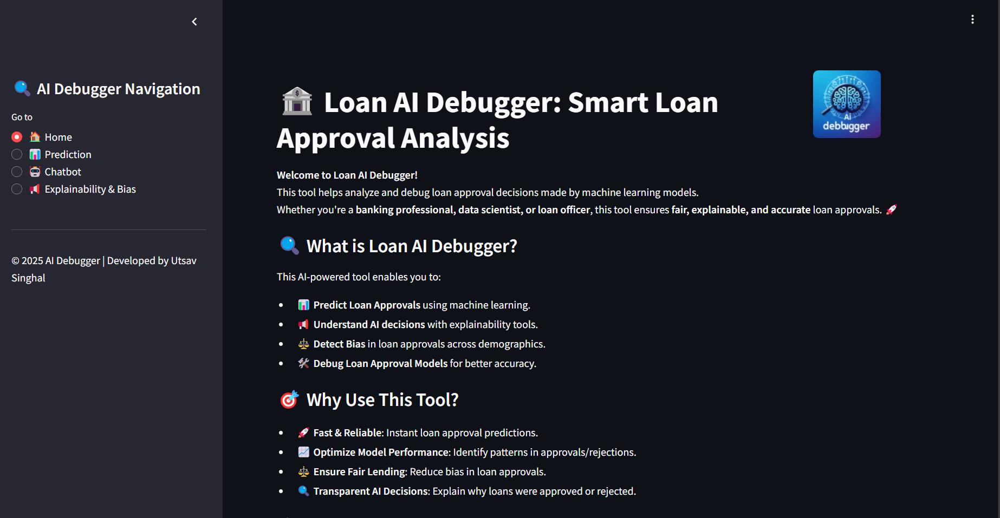
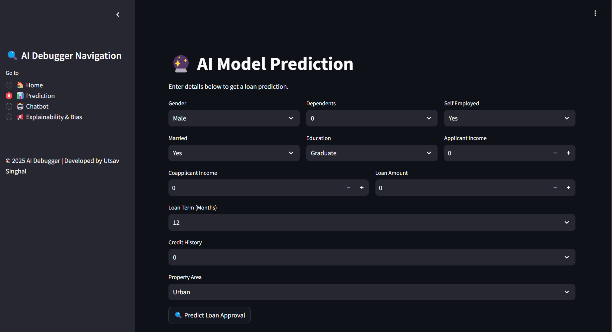
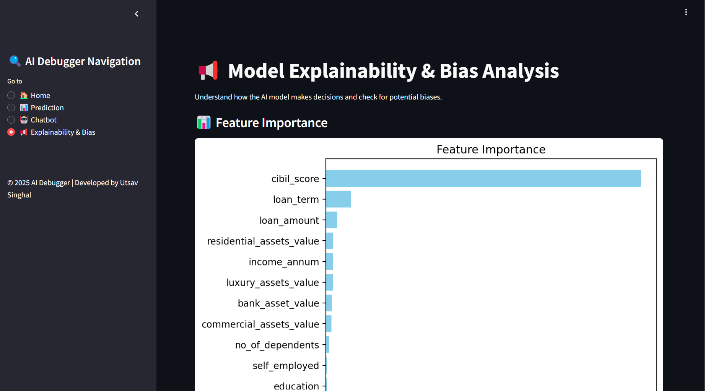
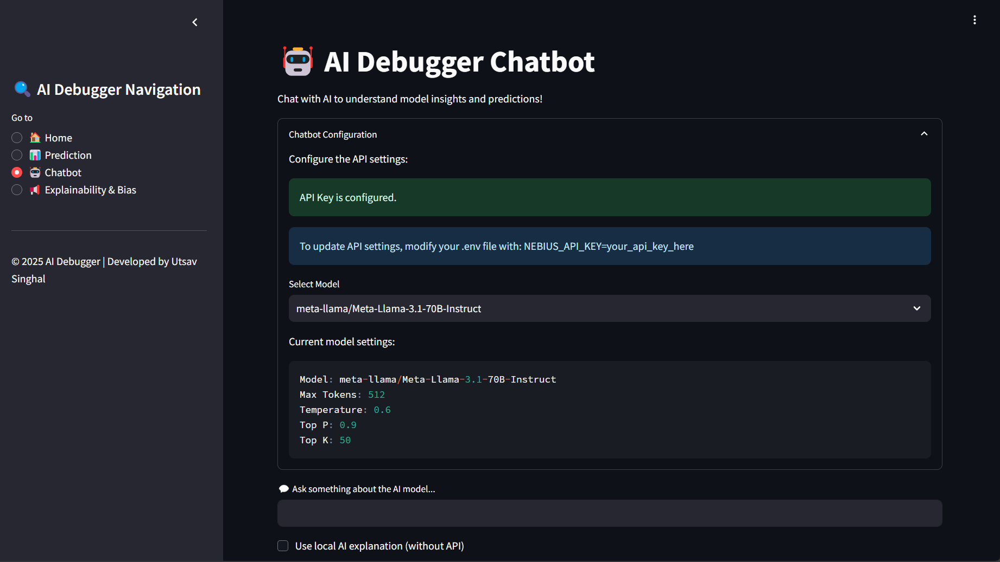

# 🏦 Loan AI Debugger 🚀

## 🔍 Overview
**Loan AI Debugger** is an AI-powered **loan approval prediction and debugging tool** that ensures **fair, explainable, and optimized** loan decision-making. Built using **Streamlit, Scikit-learn, and Nebius AI Studio**, it helps **banks, financial analysts, and data scientists** analyze and improve AI-based loan approvals.

## 🚀 Key Features
- **🔮 AI-powered Loan Prediction** – Predict loan approval status based on applicant details.
- **📊 Explainability & Bias Analysis** – Understand AI decision-making & detect bias.
- **🤖 AI Chatbot for Loan Queries** – Interactive chatbot for user assistance.
- **📢 Model Debugging & Transparency** – Visualize model behavior & fairness.
- **☁️ Cloud-based AI (Nebius AI Studio)** – Scalable AI model training & deployment.

---

## 📥 Installation & Setup Guide

### 1️⃣ Clone the Repository

Start by cloning the repository to your local machine:

```bash
git clone https://github.com/yourusername/loan-ai-debugger.git
cd loan-ai-debugger
```

### 2️⃣ Install Dependencies

Run the following command to install the required dependencies:

```bash
pip install -r requirements.txt
```

### 3️⃣ Create `.env` File

Create a `.env` file in the root directory and add the following environment variables:

```env
NEBIUS_API_KEY=your_nebius_api_key_here
```

This file contains sensitive keys and should not be committed to version control.

### 4️⃣ Run the Streamlit App

Run the Streamlit app with this command:

```bash
streamlit run app.py
```

This will launch the **Loan AI Debugger** in your web browser.

---

## 📸 Usage Instructions

### 🏠 1. Home Page
- Overview of the tool, its features, and how it works.
- Explanation of Nebius AI Studio integration.
  
**Screenshot:**


### 📊 2. Loan Prediction
- Enter applicant details (e.g., income, credit score).
- Click **Predict** to get an AI-generated loan approval decision.

**Screenshot:**


### 📢 3. Explainability & Bias Analysis
- Understand why loans are approved or rejected.
- Identify if any biases exist in the model's decision-making process.

**Screenshot:**


### 🤖 4. AI Chatbot
- Ask the chatbot questions about loans, eligibility, and more.

**Screenshot:**


---

## ⚡ Nebius AI Studio Integration

Loan AI Debugger uses **Nebius AI Studio** for:

- **🚀 AI Model Training** – Train loan prediction models on Nebius cloud.
- **🔍 Scalable AI Inference** – Deploy AI models for real-time loan approval predictions.
- **⚖️ Bias Detection** – Ensure fairness by detecting and eliminating biases in the AI models.
- **📢 Explainability** – Understand how AI makes decisions regarding loan approvals.

For more information, visit [Nebius AI Studio](https://studio.nebius.com/).

---

## 🧑‍💻 Directory Structure

Here’s the project’s directory structure:

```
loan-ai-debugger/
├── assets/
│   ├── data/
│   │   ├── label_encoders.pkl
│   │   ├── loan_data.csv
│   │   ├── trained_model.pkl
│   ├── logo.png
├── pages/
│   ├── chatbot.py
│   ├── explainability_bias.py
│   ├── home.py
│   ├── prediction.py
├── utils/
│   ├── model_utils.py
├── app.py
├── model_training.py
├── README.md
├── requirements.txt
└── .env
```

---

## 🌟 Future Enhancements
- **Add more ML models** for better accuracy.
- **Integrate advanced explainability tools** such as SHAP and LIME.
- **Improve chatbot accuracy** with AI-powered responses.

---

## 🤝 Contributing

We welcome contributions! 🚀 Feel free to:

- Open an issue for any bugs or enhancements.
- Submit a pull request for proposed changes.
- Suggest improvements for future versions.

---

## 📩 Contact

- **Email:** utsavsinghal26@gmail.com

© 2025 Loan AI Debugger | Developed by Utsav Singhal

---